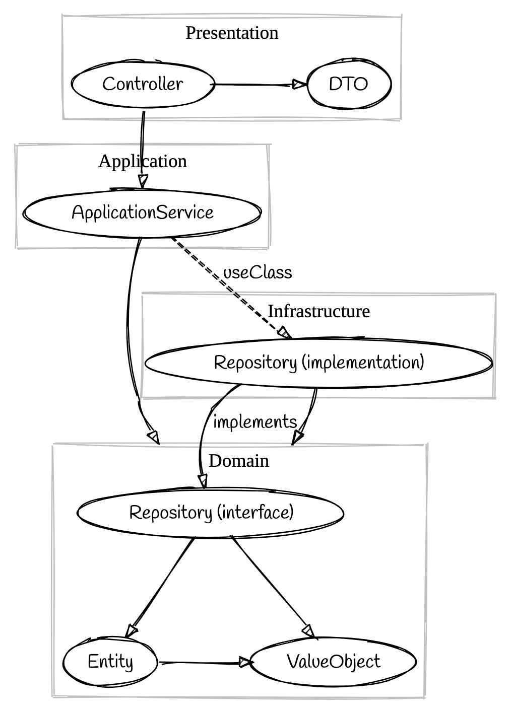

This document explains architecture of this project.

## Tiers

We split the project into four tiers: domain, infrastructure, application, and presentation. Dependencies among these tiers are as follows:



<!--
```graphiz
# https://sketchviz.com/new
digraph G {
    node [fontname = "Handlee"];
    edge [fontname = "Handlee"];

    infrastructure -> domain
    application -> domain
    application -> infrastructure
    presentation -> application
}
```
-->

### Domain

This tier represents the domain of target business. In this layer, we put the following codes:

- Value object (VO) like UserID
- Entity like User
- Domain Service
- Specification, and
- Repository interface

### Infrastructure

This tier represents the infrastructure implementation of repository. In this layer, we put the Repository implementation.

Ideally, this tier can be replaced with similar implementation that supports another datastore, without updating other tiers.

### Application

This tier represents use cases of each domain. In this layer, we put Application Service, and DTO published to the Presentation layer.

All required operations are able to handle in this tier.

### Presentation

This tier provides RESTful interface to handle feature in the application tier. Note that this tier should not refer API in domain and infrastructure tier: only DTO and application services are visible to this tier.

This presentation tier also provides [OpenAPI definition and documentation](https://docs.nestjs.com/openapi).
